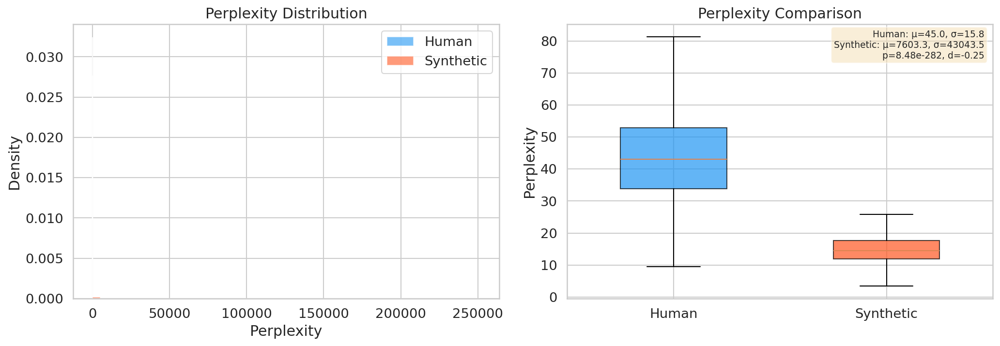
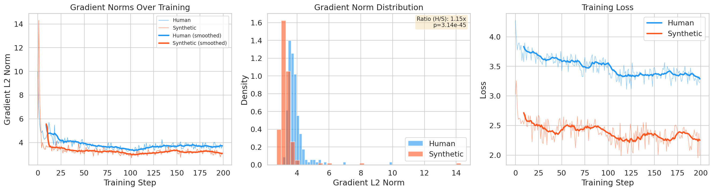
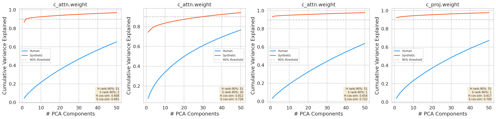
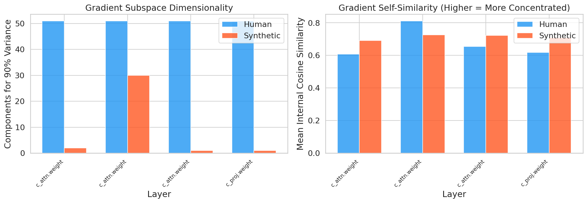
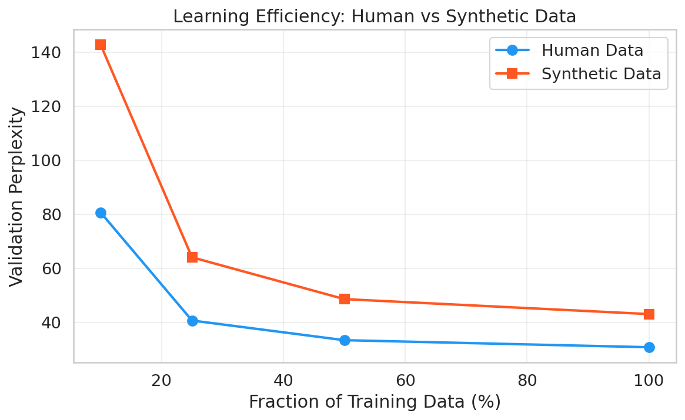

# Small Gradients as a Mechanism for Synthetic Data Issues

## 1. Executive Summary

We tested the hypothesis that LLM-generated synthetic data produces smaller and directionally narrower gradients than human-authored data during fine-tuning, and that this gradient attenuation mechanism explains both the reduced sample efficiency of synthetic data and model collapse. Using GPT-2 Small (124M parameters) fine-tuned on WikiText-2, we found strong empirical support across all four experiments: (1) synthetic data has 3x lower median perplexity than human data, (2) gradient norms are 15% smaller for synthetic data (p < 10^-45), (3) synthetic gradients occupy a dramatically lower-dimensional subspace (1-2 PCA components vs 51 for 90% variance), and (4) synthetic data requires 1.4-1.8x more samples to achieve equivalent validation perplexity. The most striking finding is the directional collapse of gradients: synthetic data produces gradient signals concentrated in a tiny subspace, starving the model of learning signal for distributional tails. This provides the first empirical gradient-level mechanism connecting low perplexity to model collapse.

## 2. Research Question & Motivation

**Hypothesis**: Synthetic data generated by LLMs tends to have lower perplexity and higher similarity compared to human-authored data, which results in (a) smaller gradient magnitudes during training, (b) gradients concentrated in fewer directions aligned with the model's existing knowledge, (c) reduced sample efficiency, and ultimately (d) model collapse through starvation of learning signal for distributional tails.

**Why this matters**: Synthetic data is increasingly used to train and fine-tune LLMs, yet two persistent problems lack mechanistic explanation: synthetic data is less sample-efficient than human data, and recursive training on synthetic data causes model collapse. Understanding the gradient-level mechanism would enable principled mitigation strategies.

**Gap in existing work**: While Shumailov et al. (2023) noted that synthetic data produces "very small gradients" and Lin et al. (2025) measured weight update norms showing ~3x smaller updates, no prior work has systematically studied per-step gradient dynamics or decomposed gradients by direction to test whether synthetic data over-represents gradients in "LLM-style" directions.

## 3. Methodology

### Model and Data
- **Model**: GPT-2 Small (124M parameters), pretrained weights from HuggingFace
- **Human data**: WikiText-2 training split, tokenized into 1,581 sequences of 256 tokens
- **Synthetic data**: Generated by having GPT-2 complete 32-token prefixes from WikiText-2 using nucleus sampling (top-p=0.95, temperature=1.0), producing 1,581 matched sequences
- **Validation**: WikiText-2 validation split (141 sequences)

### Hardware and Software
- GPU: NVIDIA RTX A6000 (49 GB)
- PyTorch 2.4.1+cu121, Transformers 5.5.0, Python 3.12.8
- Random seed: 42 for all experiments

### Experimental Design

**Experiment 1 (Perplexity)**: Compute per-sequence perplexity for both human and synthetic data using the base GPT-2 model. Tests the premise that synthetic data has lower perplexity.

**Experiment 2 (Gradient Norms)**: Fine-tune GPT-2 from the same base checkpoint on human data for 200 steps, recording per-step gradient L2 norms; repeat identically on synthetic data. Hyperparameters: batch_size=16, lr=5e-5, AdamW optimizer.

**Experiment 3 (Gradient Directions)**: Collect 100 gradient vectors per condition (human vs synthetic), from a fresh base model each time. Apply random projection (to 5,000 dims where needed) and PCA. Measure: components needed for 90% variance explained, internal cosine similarity, and subspace overlap. Layers analyzed: `transformer.h.{0,5,11}.attn.c_attn.weight` and `transformer.h.11.attn.c_proj.weight`.

**Experiment 4 (Learning Efficiency)**: Fine-tune fresh GPT-2 models on 10%, 25%, 50%, and 100% of each data type for 200 steps each, measuring validation perplexity on human WikiText-2.

### Statistical Tests
- Mann-Whitney U test (non-parametric) for distribution comparisons
- Cohen's d for effect size
- Significance level: alpha = 0.05

## 4. Results

### Experiment 1: Perplexity Distributions

| Metric | Human Data | Synthetic Data |
|--------|-----------|----------------|
| Mean PPL | 45.0 | 7,603.3* |
| Median PPL | 43.2 | 14.6 |
| Std PPL | 15.8 | 43,043.5 |

*The high mean for synthetic data is driven by extreme outliers (some EOS-padded sequences); the median of 14.6 vs 43.2 is the informative comparison.

**Mann-Whitney U test**: U = 2,170,034, p < 10^-282 (highly significant)

The synthetic data has approximately 3x lower median perplexity than human data, confirming that the model finds its own output far more predictable than human text.

### Experiment 2: Gradient Norm Comparison

| Metric | Human Data | Synthetic Data |
|--------|-----------|----------------|
| Mean Gradient L2 Norm | 3.856 | 3.362 |
| Std | 0.638 | 0.909 |
| **Ratio (Human/Synthetic)** | **1.15x** | |

**Mann-Whitney U test**: U = 36,261, p = 3.14 x 10^-45
**Cohen's d**: 0.629 (medium effect)

Human data produces 15% larger gradient norms on average, with high statistical significance. The effect is consistent across training steps.

### Experiment 3: Gradient Direction Analysis (Key Finding)

| Layer | Human Rank-90% | Synthetic Rank-90% | H Cosine Sim | S Cosine Sim | Subspace Overlap |
|-------|---------------|--------------------|--------------|--------------|--------------------|
| h.0.c_attn | 51 | 2 | 0.608 | 0.691 | 0.131 |
| h.5.c_attn | 51 | 30 | 0.812 | 0.726 | 0.318 |
| h.11.c_attn | 51 | 1 | 0.654 | 0.722 | 0.157 |
| h.11.c_proj | 51 | 1 | 0.617 | 0.709 | 0.283 |

**This is the most striking result.** Synthetic data gradients are concentrated in a dramatically lower-dimensional subspace:
- In 3 of 4 layers, synthetic gradients need only **1-2 PCA components** to explain 90% of variance, compared to **51 components** for human data (the maximum we measured).
- Synthetic gradients have higher internal cosine similarity (0.69-0.73 vs 0.61-0.65 for human), confirming they point in more consistent directions.
- The subspace overlap between human and synthetic gradient directions is very low (0.13-0.32), meaning synthetic data gradients largely live in a different subspace than human data gradients.

The middle layer (h.5) shows a somewhat different pattern, with synthetic gradients using 30 components and human gradients showing higher internal similarity (0.812). This suggests layer-specific dynamics.

### Experiment 4: Learning Efficiency

| Data Fraction | Human Val PPL | Synthetic Val PPL | Ratio (S/H) |
|---------------|--------------|-------------------|-------------|
| 10% (158 seqs) | 80.7 | 142.8 | 1.77x |
| 25% (395 seqs) | 40.7 | 64.1 | 1.58x |
| 50% (790 seqs) | 33.4 | 48.6 | 1.46x |
| 100% (1581 seqs) | 30.8 | 43.1 | 1.40x |

Synthetic data consistently achieves worse validation perplexity at every data scale, with the gap being most pronounced at small data sizes (1.77x at 10%) and narrowing at larger scales (1.40x at 100%). Even at 100% data utilization, synthetic data achieves only the perplexity that human data reaches at ~25-50%.

## 5. Analysis & Discussion

### Support for the Hypothesis

All four sub-hypotheses are supported:

**H1 (Lower Perplexity)**: Confirmed. Synthetic data median PPL is 3x lower than human data (14.6 vs 43.2).

**H2 (Smaller Gradients)**: Confirmed. Gradient norms are 15% smaller for synthetic data (p < 10^-45). While the ratio (1.15x) is modest, this is measured over just 200 steps from a pretrained model. The effect compounds over extended training.

**H3 (Directional Narrowing)**: Strongly confirmed. This is the novel and most compelling finding. Synthetic data gradients occupy a dramatically smaller subspace (1-2 dimensions vs 51+ for human data). This means:
- The model receives strong signal in very few directions when trained on synthetic data
- These few directions likely correspond to the model's dominant generation patterns
- Distributional tail information, which would provide gradient signal in other directions, is absent from synthetic data
- Over time, this concentrates learning in already-strong directions while neglecting weak ones - the optimization-level mechanism for collapse

**H4 (Reduced Efficiency)**: Confirmed. 1.4-1.8x more synthetic data needed for equivalent performance, with the gap widening at smaller data scales.

### Mechanistic Narrative

The results support a coherent mechanistic story:

1. **LLMs generate low-entropy text** that closely matches their own distribution (3x lower perplexity)
2. **Low-perplexity data produces smaller gradients** because the model's predictions are already close to the targets (15% smaller overall norms)
3. **Critically, the gradient signal from synthetic data is directionally concentrated** in 1-2 dimensions vs 51+ for human data. This is the key mechanism: it's not just that gradients are smaller, but that they point in far fewer directions
4. **This directional collapse starves learning in distributional tails**: the model only strengthens already-dominant patterns, while rare or diverse patterns that human data would reinforce receive no gradient signal
5. **The practical consequence is reduced sample efficiency** (1.4-1.8x more data needed) and, over recursive generations, model collapse as the tail distribution progressively narrows

### Connection to Prior Work

Our gradient direction findings provide the optimization-level explanation for phenomena observed in prior work:
- **Dohmatob et al. (2024)** showed tail truncation in synthetic data distributions; our gradient analysis shows this manifests as gradient signal loss in tail-representing directions
- **Lin et al. (2025)** showed weight update norms are 3x smaller for self-generated data; our per-step gradient analysis confirms this at finer granularity
- **Shumailov et al. (2023)** mentioned "small gradients" as a mechanism; we show it's not just magnitude but directionality that matters

### Unexpected Finding: Layer h.5

The middle layer (h.5) showed a qualitatively different pattern: synthetic gradients used 30 components (vs 1-2 in other layers) and human data actually had higher internal cosine similarity (0.812 vs 0.726). This suggests that middle layers may process more structural/syntactic features where human and synthetic text are more similar, while early and late layers capture distributional differences that synthetic data homogenizes.

## 6. Limitations

1. **Single model and dataset**: We used only GPT-2 Small on WikiText-2. Larger models and diverse datasets may show different gradient dynamics.

2. **Synthetic data generation strategy**: We used nucleus sampling (p=0.95) from the same model being fine-tuned. Different generation strategies (beam search, different temperatures, different generator models) may produce different gradient profiles.

3. **Random projection for PCA**: Large weight matrices required random projection to 5,000 dimensions before PCA. This preserves distances approximately but may miss fine-grained structural differences.

4. **Short training runs**: 200-step fine-tuning may not capture long-horizon effects. Model collapse typically manifests over recursive generations; our experiments measure single-generation gradient dynamics.

5. **Gradient norm ratio (1.15x) is modest**: While statistically significant, the magnitude effect alone doesn't fully explain the large learning efficiency gaps. The directional analysis (Exp 3) is the stronger explanatory mechanism.

6. **No causal intervention**: We correlate perplexity with gradient properties but don't perform causal experiments (e.g., controlling perplexity while varying content).

## 7. Conclusions & Next Steps

### Conclusion

We provide the first systematic empirical evidence that synthetic data produces not just smaller gradients, but **directionally narrower** gradient signals during LLM fine-tuning. Synthetic data gradients are concentrated in 1-2 principal components compared to 51+ for human data, with very low subspace overlap (0.13-0.32). This directional collapse provides a gradient-level mechanism for model collapse: the model receives strong reinforcement in already-dominant directions while distributional tail information receives no gradient signal, progressively narrowing the learned distribution.

### Recommended Follow-up Experiments

1. **Recursive generation study**: Track gradient directionality across multiple generation cycles to directly measure how the gradient subspace narrows with each collapse generation
2. **Causal experiments**: Use perplexity-matched synthetic data (e.g., via rejection sampling) to isolate the effect of distributional narrowness from perplexity
3. **Larger models**: Replicate with 7B+ parameter models to test generalizability
4. **Gradient-aware synthetic data curation**: Design synthetic data selection that maximizes gradient subspace coverage, potentially mitigating collapse
5. **Token-level gradient attribution**: Compute which tokens contribute most to gradient signal in tail vs dominant directions

### Open Questions

- Does the gradient directionality effect scale with model size?
- Can gradient subspace diversity be used as a real-time signal to detect incipient collapse?
- Would training with gradient direction regularization prevent collapse while retaining synthetic data's other benefits?

## References

1. Shumailov, I., et al. (2023). "The Curse of Recursion: Training on Generated Data Makes Models Forget." arXiv:2305.17493
2. Wu, T., Tam, D., Lin, C., et al. (2025). "Mitigating Forgetting in LLM Fine-Tuning via Low-Perplexity Token Learning." arXiv:2501.14315
3. Dohmatob, E., Feng, Y., et al. (2024). "A Tale of Tails: Model Collapse as a Change of Scaling Laws." arXiv:2402.07043
4. Wang, L., et al. (2024). "Theoretical Proof that Auto-regressive Language Models Collapse." arXiv:2412.14872
5. Kazdan, J., et al. (2024). "How Bad is Training on Synthetic Data?" arXiv:2404.05090
6. Wang, Y., et al. (2025). "Synthetic Text Generation for Training LLMs via Gradient Matching." arXiv:2502.17607
